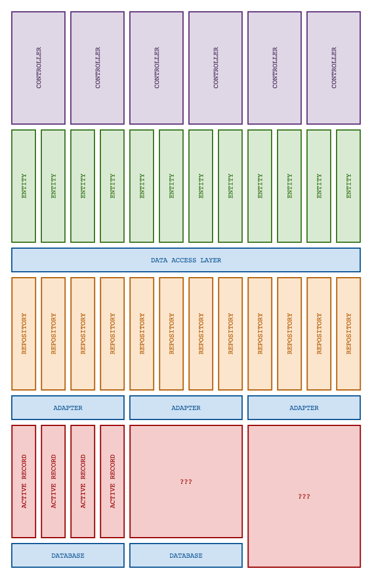

# DAL (Data Access Layer)



[]()
[]()
[]()
[]()
<br/>

**DAL** is a data access layer for PHP, built to add an additional layer of
abstraction between your application and persistence layers. The main goal of
this library is to allow use of multiple persistence layers, each potentially
employing different abstraction patterns, under a *single* interface.

The [data mapper pattern][data-mapper] is great for keeping the particulars of
data persistence hidden behind its interfaces. DAL improves upon this
abstraction to include multiple persistence layers while providing underlying
support for patterns other than data mapper (e.g.
[active record][active-record]).

We're using this in-house to move our application towards a more manageable data
mapper layer rather than our current active record implementation. This will be
our interface into persistence across our PHP applications for the foreseeable
future. We will continue to use our active record implementation underneath DAL
until we decide to remove it completely, at which point DAL will stay put.

The main interface of DAL mimics the API of Doctrine ORM, with similarly named
`getRepository()`, `persist()` and `flush()` methods. The repositories exposed
through the `getRepository()` method even implement Doctrine's
`ObjectRepository`, all with the aim of having a common ground with one of the
most feature-complete data mapper libraries for PHP.

It can be installed in whichever way you prefer, but we recommend
[Composer][packagist].
```json
{
    "require": {
        "graze/dal": "^1.0"
    }
}
```
```bash
$ composer require graze/dal
```

## Documentation

- [Getting started with Eloquent](#getting-started-with-eloquent)
- [Getting started with Doctrine](#getting-started-with-doctrine)
- [Getting started with PDO](#getting-started-with-pdo)
- [Relationships](#relationships)
  - [Many to many relationships](#many-to-many-relationships)
- [Using Multiple Adapters](#using-multiple-adapters)
- [Database Support](#database-support)

## Getting started with Eloquent

Using Eloquent with DAL requires the `illuminate/eloquent` package. You may also find the following resources helpful if
you're using Eloquent outside of Laravel: [How to use Eloquent outside of Laravel](https://laracasts.com/lessons/how-to-use-eloquent-outside-of-laravel), [Using Eloquent outside Laravel](https://vkbansal.me/blog/using-eloquent-outside-laravel/).

#### Setting up the DalManager
```php
use Graze\Dal\Adapter\Orm\EloquentOrmAdapter;

$eloquentAdapter = EloquentOrmAdapter::createFromYaml(/*Eloquent DB Connection*/, ['path/to/config/eloquent.yml']);
$dal = new DalManager([$eloquentAdapter]);
```

We've got a `DalManager` object setup in our application, now we need to write some configuration for our entities:

#### Writing the config

Adapters come with two methods of configuration `createFromYaml` and `createFromArray`, in this documentation all examples are
in YAML, but you can just use an array or anything that can convert into an array.

```yaml
App\Entity\Product:
    record: App\Eloquent\Product
    adapter: Graze\Dal\Adapter\Orm\EloquentOrmAdapter
    repository: App\Repository\ProductRepository
    table: products
    fields:
        id:
            mapsTo: id
            type: int
        name:
            mapsTo: name
            type: string
```

This is the config for a basic `Product` entity in our application. It's configured with the following fields:

- `record` - This is the class provided by your persistence layer, in this case an Eloquent model.
- `adapter` - This is the adapter this entity will be managed by.
- `repository` (optional) - This is the custom repository class for this entity, DAL provides a generic repository if you don't specify one here.
- `table` - This field is specific to the adapter, in this case we need to provide our Eloquent model with the table name for this entity.
- `fields` - Defines each field on the entity, the `mapsTo` field refers to the property on the underlying Eloquent model that we're going to use for this field.

#### Generating the classes

With this setup, we don't actually need to write any PHP code for our entity, DAL can generate it all for us. By running this command,
DAL will generate an entity class, a repository and the underlying Eloquent model we need to get started.

```bash
$ bin/dal generate path/to/config/eloquent.yml App src
```

#### Using the DalManager

We've now got everything we need to start using our entity, which is done like so:

```php
$product = $dalManager->getRepository('App\Entity\Product')->find(1);
echo $product->getName();
```

## Getting started with Doctrine

Getting started with Doctrine is very similar to Eloquent. The key differences are that DAL does not currently support
generating the underlying Doctrine classes and configurationg for you, so you will need to write that yourself. You will
also need the `doctrine/orm` package.

#### Setting up the DalManager

```php
use Graze\Dal\Adapter\Orm\DoctrineOrmAdapter;
use Doctrine\ORM\EntityManager;

$em = new EntityManager(); // see Doctrine's documentation for setting this up
$doctrineAdapter = DoctrineOrmAdapter::createFromYaml($em, ['path/to/config/doctrine.yml']);
$dal = new DalManager([$doctrineAdapter]);
```

#### Writing the config

```yaml
App\Entity\Product:
    record: App\Doctrine\Product
    repository: App\Repository\ProductRepository
    fields:
        id:
            mapsTo: id
            type: int
        name:
            mapsTo: name
            type: string
```

You will also need to write the Doctrine config for the underlying Doctrine entity.

#### Generating the DAL entities and repositories

```bash
$ bin/dal generate path/to/config/doctrine.yml App src
```

**Note:** Generating Doctrine entities is currently **not supported**. You will have to write those yourself.

#### Using the DalManager

```php
$product = $dalManager->getRepository('App\Entity\Product')->find(1);
echo $product->getName();
```

## Getting started with PDO

DAL also has a very plain `PdoAdapter` if you don't need the features that ORMs come with but you still want
a sensible set of interfaces for managing your data. This does rely on the `aura/sql` package though, so make sure you 
have that configured as a dependency of your app.

#### Setting up the DalManager

```php
use Graze\Dal\Adapter\Pdo\PdoAdapter;
use Aura\Sql\ExtendedPdo;

$pdo = new ExtendedPdo(); // @see https://github.com/auraphp/Aura.Sql#lazy-connection-instance for setting this up
$pdoAdapter = PdoAdapter::createFromYaml($pdo, ['path/to/config/pdo.yml']);
$dal = new DalManager([$pdoAdapter]);
```

#### Writing the config

```yaml
App\Entity\Product:
    table: products
    repository: App\Repository\ProductRepository
    fields:
        id:
            mapsTo: id
            type: int
        name:
            mapsTo: name
            type: string
```

Notice that there's no `record` field here, as there is no underlying model or record class with PDO this is unnecessary.

#### Generating the DAL entities and repositories

There's no records/models to generate, so we just need to generate the DAL entities and repositories by running:

```bash
$ bin/dal generate path/to/config/pdo.yml App src
```

#### Using the DalManager

```php
$product = $dalManager->getRepository('App\Entity\Product')->find(1);
echo $product->getName();
```

## Relationships

Relationships between entities should be defined at the DAL level and not in the underlying persistence layers. This is
to facilitate entities being managed by different adapters.

```yaml
App\Entity\Customer:
    record: App\Eloquent\Customer
    repository: App\Repository\CustomerRepository
    table: customers
    fields:
        id:
            mapsTo: id
            type: int
        firstName:
            mapsTo: first_name
            type: string
        lastName:
            mapsTo: last_name
            type: string
    related:
        orders:
            type: oneToMany
            entity: App\Entity\Order
            foreignKey: customer_id
            collection: true

App\Entity\Order:
    record: App\Eloquent\Order
    table: orders
    fields:
        id:
            mapsTo: id
            type: int
        price:
            mapsTo: price
            type: float
    related:
        customer:
            type: manyToOne
            entity: App\Entity\Customer
            localKey: customer_id
```

This example shows a simple relationship between a Customer and an Order. The Customer owns many Orders and so has a `oneToMany`
type with the Order entity, using the `customer_id` field on the orders table as a foreign key and we denote that this will
be a collection of entities.

On the Order entity configuration, we have a single Customer field defined as `manyToOne` as an Order belongs to a Customer
and this uses the `customer_id` field on the orders table as the local key for determining which Customer owns this Order.

The `localKey` and `foreignKey` refer to fields on the database tables themselves, not the DAL entities or underlying persistence
layer entities. For this reason, relationships are currently only supported where on at least one side of the relationship there is an entity using SQL as its underlying
storage mechanism.

The example above shows the `manyToOne` and `oneToMany` relationship types, there is also `manyToMany`.

#### Many to many relationships

Many to many relationships require two entities and a pivot table that stores the relationship between them:

```yaml
App\Entity\Order:
    record: App\Eloquent\Order
    table: orders
    fields:
        id:
            mapsTo: id
            type: int
        price:
            mapsTo: price
            type: float
    related:
        customer:
            type: manyToOne
            entity: App\Entity\Customer
            localKey: customer_id
        products:
            type: manyToMany
            entity: App\Entity\Product
            pivot: order_item
            localKey: order_id
            foreignKey: product_id
            collection: true
```

Here we have extended our Order entity to relate to many Products and of course, a single Product can also belong to many
Orders.

As with other relationships we define the `type` and the `entity`, then we need to define the `pivot` table and the two keys,
`localKey` and `foreignKey` that are on the pivot table. The `localKey` being the field storing the ID for the entity this
configuration is for, in this case Order, and the `foreignKey` being the field storing the ID for the entity that we're
relating to, in this case Product.

```bash
$ bin/dal generate path/to/config/eloquent.yml App src
```

```php
$customer = $dalManager->getRepository('App\Entity\Customer')->findBy(['email' => 'customer@example.com']);
$orders = $customer->getOrders();

foreach ($orders as $order) {
    echo $order->getPrice();
}
```

## Using Multiple Adapters

```php
use Graze\Dal\Adapter\Pdo\PdoAdapter;
use Graze\Dal\Adapter\Orm\EloquentOrmAdapter;
use Aura\Sql\ExtendedPdo;

$pdoAdapter = PdoAdapter::createFromYaml(new ExtendedPdo(/*see Aura docs*/), ['path/to/config/pdo.yml']);
$eloquentAdapter = EloquentOrmAdapter::createFromYaml(/* see eloquent docs */, ['path/to/config/eloquent.yml']);
$dalManager = new DalManager([$pdoAdapter, $eloquentAdapter]);
```

Now that we've got a DalManager setup with two configured adapters, we can write config to setup two entities with
different adapters and create relationships between them:

```yaml
# eloquent.yml
App\Entity\Customer:
    record: App\Eloquent\Customer
    repository: App\Repository\CustomerRepository
    table: customers
    fields:
        id:
            mapsTo: id
            type: int
        firstName:
            mapsTo: first_name
            type: string
        lastName:
            mapsTo: last_name
            type: string
    related:
        orders:
            type: oneToMany
            entity: App\Entity\Order
            foreignKey: customer_id
            collection: true

# pdo.yml
App\Entity\Order:
    table: orders
    fields:
        id:
            mapsTo: id
            type: int
        price:
            mapsTo: price
            type: float
    related:
        customer:
            type: manyToOne
            entity: App\Entity\Customer
            localKey: customer_id
```

Now we can generate all the entities, repositories and records we need:

```bash
$ bin/dal generate path/to/config/eloquent.yml App src
```

And use just like we have in all the previous examples:

```php
$customer = $dalManager->getRepository('App\Entity\Customer')->findBy(['email' => 'customer@example.com']);
$orders = $customer->getOrders();

foreach ($orders as $order) {
    echo $order->getPrice();
}
```

This allows us to have different data handled by different adapters and storage mechanisms but create relationships
between them through a single interface. How each entity is managed behind the scenes is abstracted away from our
high-level code.

This opens up possibilities such as:

```php
use Graze\Dal\Adapter\Orm\EloquentOrmAdapter;
use App\Dal\Adapter\HttpAdapter;

$httpAdapter = HttpAdapter::createFromYaml(new GuzzleHttp\Client(), ['path/to/config/http.yml']);
$eloquentAdapter = EloquentOrmAdapter::createFromYaml(/* see eloquent docs */, ['path/to/config/eloquent.yml']);
$dalManager = new DalManager([$httpAdapter, $eloquentAdapter]);
```

## Database Support

In theory, DAL supports any database that is supported by the underlying persistence layers, Doctrine, Eloquent etc. However
DAL only officially supports MySQL. This is because the code that handles the relationship types does currently rely on SQL
queries written within DAL which have only been tested on MySQL.

If you're working with a database that is supported by your persistence layer, do give it a go, in 90% of cases it will probably
work great. We will work to officially support other databases in the future.

## Contributing & Support

If you have a support query, please open an issue and label it as 'support'. If you'd like to contribute, please
open a PR or an issue to discuss it first. Documentation contributions are incredibly welcome.

#### Development

There's a docker-compose file that you can use to spin up an environment for development and testing:

```bash
$ make install
$ make test
```

## License
The content of this library is released under the **MIT License** by
**Nature Delivered Ltd**.<br/> You can find a copy of this license in
[`LICENSE`][license] or at http://opensource.org/licenses/mit.

<!-- Project links -->
[travis]: https://travis-ci.org/graze/dal
[travis-master]: https://travis-ci.org/graze/dal.png?branch=master
[packagist]: https://packagist.org/packages/graze/dal

<!-- References -->
[data-mapper]: http://en.wikipedia.org/wiki/Data_mapper_pattern
[active-record]: http://en.wikipedia.org/wiki/Active_record_pattern
[doctrine-orm]: http://docs.doctrine-project.org/projects/doctrine-orm/en/latest/

<!-- Files -->
[license]: /LICENSE
